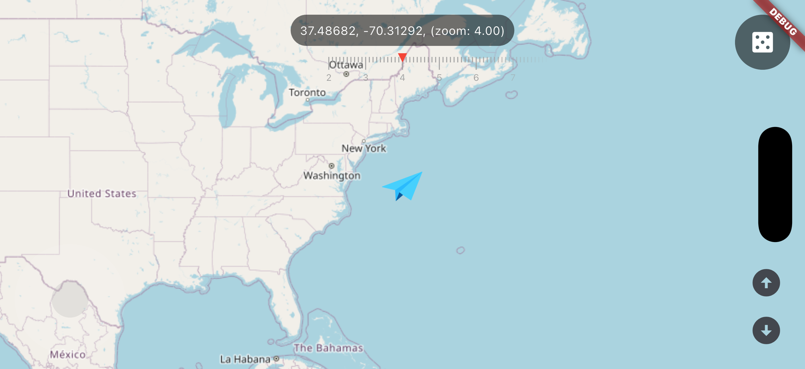
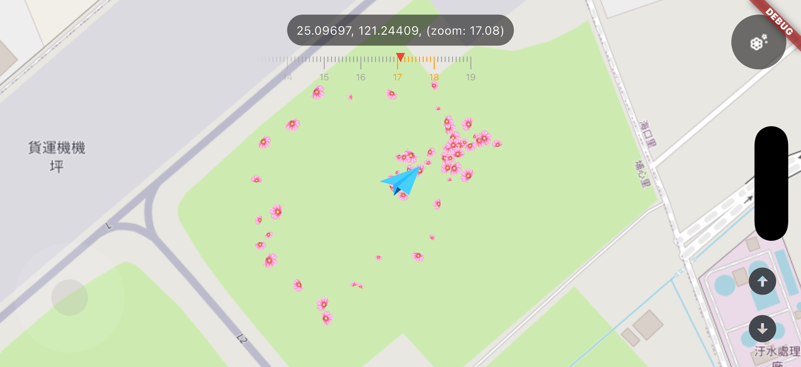
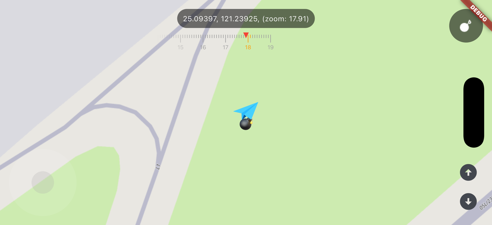

# Paper Plane

一個基於 Flutter 的互動式地圖應用，讓你駕駛紙飛機環遊世界。

## 功能特色

- **搖桿控制** — 自製虛擬搖桿控制地圖移動與紙飛機飛行
- **縮放控制** — 支援持續長按加速縮放
- **炸彈投放** — 在精確的縮放下投放炸彈，留下焦痕
- **花瓣種植** — 飛過之處綻放花瓣，持久化保存
- **標記放置** — 在地圖上放置地點標記
- **隨機傳送** — 一鍵傳送到世界任意角落
- **紙飛機動畫** — 浮動、旋轉、翻轉動畫效果

## 截圖

| 主畫面 | 花瓣模式 | 炸彈投放 |
|--------|----------|----------|
|  |  |  |

## 操作說明

### 搖桿
- **拖曳**: 控制地圖移動方向與速度
- **鬆手**: 搖桿自動回中，地圖停止移動

### 功能切換器（右上角）
- **左右滑動**: 切換功能（花瓣 → 炸彈 → 標記 → 傳送）
- **點擊**: 執行當前功能
- **長按**（花瓣模式下）: 清除所有花瓣

### 縮放控制（右下角）
- **點擊 +/-**: 單次縮放
- **長按 +/-**: 持續加速縮放

### 功能詳情

| 功能 | 縮放範圍 | 說明 |
|------|----------|------|
| 🌸 花瓣 | 17.0–18.0 | 點擊進入花瓣模式，飛過之處自動種花，最多 100 朵，保存 24 小時 |
| 💣 炸彈 | 17.9–18.1 | 點擊投放炸彈，落下後留下焦痕 |
| 📍 標記 | ≥ 19.0 | 點擊在地圖中心放置紅色標記 |
| 🎲 傳送 | 任意 | 點擊隨機傳送到世界任意角落 |

## 架構

### 狀態管理：BLoC/Cubit

使用 `flutter_bloc` 套件，共 7 個 Cubit：

| Cubit | 職責 |
|-------|------|
| `JoystickCubit` | 搖桿位置與狀態（Idle / Dragging / Animating） |
| `ZoomCubit` | 地圖縮放等級 |
| `PlaneCubit` | 紙飛機位置、旋轉、浮動動畫 |
| `MarkerCubit` | 地圖標記（持久化） |
| `BurnMarkCubit` | 炸彈焦痕（持久化） |
| `BlossomCubit` | 花瓣資料（持久化） |
| `FunctionSwitcherCubit` | 功能切換狀態 |

### Cubit 依賴關係

```
MapController ──┐
                ├──→ PlaneCubit
JoystickCubit ──┘
```

`PlaneCubit` 訂閱 `MapController` 的地圖事件與 `JoystickCubit` 的狀態變化，計算紙飛機的位置與旋轉角度。

### Widget 消費關係

| Widget | 使用的 Cubit |
|--------|-------------|
| `JoystickOverlay` | JoystickCubit, PlaneCubit |
| `ZoomControls` | ZoomCubit, PlaneCubit |
| `PlaneOverlay` | PlaneCubit |
| `BlossomOverlay` | PlaneCubit, BlossomCubit |
| `BombOverlay` | BurnMarkCubit |
| `BlossomLayer` | BlossomCubit |
| `BurnMarkLayer` | BurnMarkCubit |
| `MapMarkers` | MarkerCubit |
| `FunctionSwitcher` | FunctionSwitcherCubit |
| `ZoomScale` | FunctionSwitcherCubit, ZoomCubit |

## 專案結構

```
paperplane/
├── lib/
│   ├── constants/
│   │   └── map_constants.dart        # 地圖相關常數
│   ├── cubit/
│   │   ├── blossom/                  # 花瓣 Cubit + State
│   │   ├── burn_mark/                # 焦痕 Cubit + State
│   │   ├── function_switcher/        # 功能切換 Cubit + State
│   │   ├── joystick/                 # 搖桿 Cubit + State
│   │   ├── marker/                   # 標記 Cubit + State
│   │   ├── plane/                    # 紙飛機 Cubit + State
│   │   └── zoom/                     # 縮放 Cubit + State
│   ├── pages/
│   │   └── map_page.dart             # 單一頁面
│   ├── utils/
│   │   └── rotation_utils.dart       # 旋轉計算工具
│   ├── widgets/
│   │   ├── blossom_layer.dart        # 花瓣地圖圖層
│   │   ├── blossom_overlay.dart      # 花瓣種植邏輯
│   │   ├── bomb_overlay.dart         # 炸彈動畫
│   │   ├── burn_mark_layer.dart      # 焦痕地圖圖層
│   │   ├── function_switcher.dart    # 功能切換按鈕
│   │   ├── joystick_overlay.dart     # 虛擬搖桿
│   │   ├── map_info_overlay.dart     # 座標資訊顯示
│   │   ├── map_markers.dart          # 標記地圖圖層
│   │   ├── plane_overlay.dart        # 紙飛機顯示
│   │   ├── random_teleport_button.dart
│   │   ├── zoom_controls.dart        # 縮放按鈕
│   │   └── zoom_scale.dart           # 縮放比例尺
│   └── main.dart
├── assets/
│   └── images/
│       ├── plane.png                 # 紙飛機圖片
│       ├── bomb.png                  # 炸彈圖片
│       └── blossom.png               # 花瓣圖片
└── test/
    ├── widget_test.dart              # 主要 Widget 測試
    ├── unit/                         # 單元測試
    │   ├── rotation_utils_test.dart
    │   └── zoom_cubit_test.dart
    ├── widget/                       # Widget 測試
    │   ├── joystick_overlay_test.dart
    │   ├── plane_overlay_test.dart
    │   └── zoom_controls_test.dart
    └── helpers/
        └── fake_plane_cubit.dart     # 測試用 Fake
```

## 開發環境

- Flutter SDK: ^3.12.2
- Dart SDK: ^3.12.2

## 快速開始

```bash
# 進入 Flutter 專案目錄
cd paperplane

# 安裝依賴
flutter pub get

# 執行應用
flutter run
```

## 測試

```bash
cd paperplane

# 執行所有測試
flutter test

# 靜態分析
flutter analyze
```

## 依賴套件

| 套件 | 版本 | 用途 |
|------|------|------|
| `flutter_map` | ^7.0.2 | 地圖顯示（OpenStreetMap） |
| `latlong2` | ^0.9.1 | 經緯度運算 |
| `flutter_bloc` | ^9.1.1 | 狀態管理（BLoC/Cubit） |
| `vector_math` | ^2.1.4 | 向量與矩陣運算 |
| `shared_preferences` | ^2.2.0 | 本地資料持久化 |

## 平台

- **iOS / macOS** — 使用 Swift + SwiftUI
- **Android** — 使用 Kotlin
